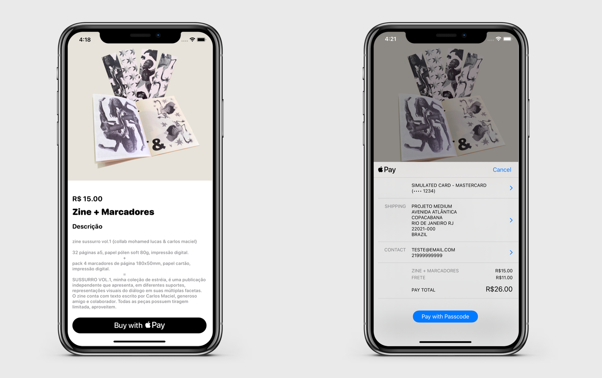

# Lily 

[]()
[]()

Projeto mostrando o funcionamento de um App Clip e sua integração com o Apple Pay.

A explicação mais completa você pode encontrar no nosso artigo do [Medium](https://vitorkrau.medium.com/integrando-pagamentos-com-apple-pay-app-clip-8c999777a763).

## Demo



## Instalação

#### Cocoapods
Para instalar as dependências, na pasta raiz do projeto execute o comando:

```bash
pod install
```
A partir daí, sempre abra o projeto pelo .xcworkspace.

#### Python
Dentro da pasta **Server**:

Crie um Virtual Environment com o comando:

```bash
python3 -m venv env
```
Ative o Vitual Environment

MacOS
```bash
source env/bin/activate
```

Instale as dependências localizadas no arquivo requirements.txt
```bash
pip3 install -r requirements.txt
```

Por fim, atualize os campos dentro do projeto no Xcode assim como no server.py com as respectivas chaves pública e privada de teste fornecidas pela API do Stripe.

## Executando
Rode o projeto no simulador do iPhone, e antes de testar a funcionalidade do Apple Pay, abra o servidor. Dentro da pasta **Server**, execute o comando:

```bash
python3 server.py
```


## Contribuindo
Pull requests são bem-vindos. Para mudanças maiores, abra uma issue para conversarmos.
